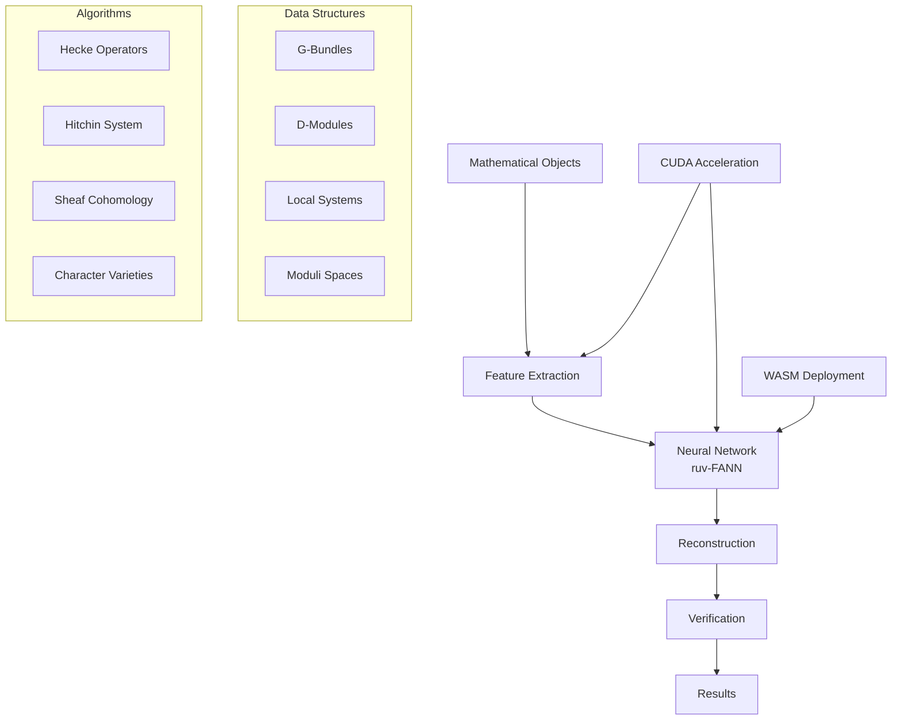

# 🚀 Implement Computational Geometric Langlands Conjecture Framework

## 🎯 Overview

This issue tracks the implementation of a computational framework for exploring the geometric Langlands conjecture using Rust, CUDA, WASM, and neural networks (ruv-FANN). This represents one of the most ambitious mathematical computational projects, bridging abstract category theory with practical machine learning.

## 📋 Background

The geometric Langlands conjecture, recently proven by Gaitsgory-Raskin team (2024), establishes a profound duality between:
- **Automorphic side**: D-modules on moduli stacks of G-bundles
- **Spectral side**: Local systems (representations of fundamental groups)

Our goal is to create the first comprehensive computational framework that can:
1. Represent and manipulate these mathematical objects algorithmically
2. Use neural networks to learn the correspondence patterns
3. Verify conjectured relationships computationally
4. Provide tools for mathematical exploration and discovery

## 🏗️ Architecture Overview



## 📝 Implementation Plan

### Phase 1: Core Mathematical Structures (Weeks 1-4)

#### 1.1 Basic Data Structures
- [ ] **Bundle Representation** (`src/geometry/bundle.rs`)
  - Transition functions on overlaps
  - Gauge equivalence checking
  - Stability conditions
- [ ] **Local System** (`src/topology/local_system.rs`)
  - Monodromy representations
  - Character variety coordinates
  - Irreducibility checking
- [ ] **D-Module** (`src/algebra/d_module.rs`)
  - Differential operators
  - Regular singularities
  - Hecke eigenproperty
- [ ] **Moduli Space** (`src/geometry/moduli.rs`)
  - Stack structure with automorphisms
  - Local coordinates
  - Deformation theory

#### 1.2 Feature Extraction System
- [ ] **Invariant Computation** (`src/features/invariants.rs`)
  - Chern classes
  - Traces and eigenvalues
  - Topological invariants
- [ ] **Encoding Pipeline** (`src/features/encoding.rs`)
  - Object → Vector conversion
  - Normalization strategies
  - Dimensionality reduction

### Phase 2: Core Algorithms (Weeks 5-8)

#### 2.1 Hecke Operators
- [ ] **Classical Hecke** (`src/algorithms/hecke.rs`)
  - Matrix representation
  - Eigenvalue computation
  - Correspondence verification
- [ ] **Geometric Hecke** (`src/algorithms/geometric_hecke.rs`)
  - Functorial implementation
  - Beilinson-Drinfeld construction
  - GPU acceleration points

#### 2.2 Hitchin System
- [ ] **Hitchin Map** (`src/algorithms/hitchin.rs`)
  - Characteristic polynomial computation
  - Spectral curves
  - Integrable system structure
- [ ] **Spectral Data** (`src/algorithms/spectral.rs`)
  - Line bundle construction
  - Prym varieties
  - Mirror symmetry checks

#### 2.3 Computational Methods
- [ ] **Sheaf Cohomology** (`src/algorithms/cohomology.rs`)
  - Čech complex implementation
  - Spectral sequence computation
  - CUDA parallelization
- [ ] **Representation Enumeration** (`src/algorithms/representations.rs`)
  - Fundamental group presentations
  - Matrix solution search
  - Conjugacy class optimization

### Phase 3: Neural Network Integration (Weeks 9-12)

#### 3.1 Network Architecture
- [ ] **Base Network** (`src/nn/langlands_net.rs`)
  - Multi-layer perceptron design
  - Cascade correlation option
  - Loss function design
- [ ] **Training Pipeline** (`src/nn/training.rs`)
  - Data generation/loading
  - Batch processing
  - Validation strategies

#### 3.2 Hybrid System
- [ ] **Symbolic-Neural Bridge** (`src/nn/hybrid.rs`)
  - Feature encoder
  - Result decoder
  - Constraint enforcement
- [ ] **Verification Module** (`src/nn/verification.rs`)
  - Mathematical property checks
  - Confidence scoring
  - Error analysis

### Phase 4: CUDA/WASM Implementation (Weeks 13-16)

#### 4.1 CUDA Acceleration
- [ ] **Matrix Operations** (`cuda/matrix_ops.cu`)
  - Eigenvalue computation
  - Tensor products
  - Group actions
- [ ] **Parallel Algorithms** (`cuda/parallel_algos.cu`)
  - Representation search
  - Cohomology computation
  - Feature extraction

#### 4.2 WASM Deployment
- [ ] **Core Bindings** (`wasm/bindings.rs`)
  - JavaScript interface
  - Memory management
  - Async operations
- [ ] **Web Interface** (`wasm/interface.rs`)
  - Visualization tools
  - Interactive exploration
  - Result presentation

### Phase 5: Testing & Validation (Weeks 17-20)

#### 5.1 Test Suite
- [ ] **Unit Tests** (`tests/unit/`)
  - Mathematical object properties
  - Algorithm correctness
  - Feature extraction accuracy
- [ ] **Integration Tests** (`tests/integration/`)
  - End-to-end correspondence checking
  - Known case validation
  - Performance benchmarks

#### 5.2 Mathematical Validation
- [ ] **GL(1) Case** - Abelian correspondence (Fourier transform)
- [ ] **GL(2) Genus 0** - Drinfeld's examples
- [ ] **Rank 2 Bundles** - Narasimhan-Seshadri correspondence
- [ ] **Physics Checks** - S-duality verification

### Phase 6: Documentation & Publishing (Weeks 21-24)

#### 6.1 Documentation
- [ ] **Mathematical Guide** (`docs/math_guide.md`)
- [ ] **API Documentation** (Rust docs)
- [ ] **Examples Gallery** (`examples/`)
- [ ] **Performance Guide** (`docs/performance.md`)

#### 6.2 Publishing
- [ ] **Crate Preparation**
  - Cargo.toml optimization
  - Feature flags setup
  - Dependency management
- [ ] **WASM Package**
  - npm package creation
  - CDN deployment
  - Demo website
- [ ] **Academic Paper**
  - Method description
  - Results analysis
  - Future directions

## 🔧 Technical Requirements

### Dependencies
```toml
[dependencies]
ruv-fann = "0.4"
nalgebra = "0.32"
ndarray = "0.15"
petgraph = "0.6"
serde = { version = "1.0", features = ["derive"] }
rayon = "1.7"
num-complex = "0.4"

[dev-dependencies]
criterion = "0.5"
proptest = "1.2"

[build-dependencies]
cuda-builder = "0.3"
wasm-bindgen = "0.2"
```

### System Requirements
- Rust 1.70+
- CUDA Toolkit 12.0+ (optional, for GPU acceleration)
- wasm-pack 0.12+ (for WASM builds)
- 16GB+ RAM recommended
- GPU with 8GB+ VRAM (optional)

## 📊 Success Metrics

### Performance Targets
- [ ] Process rank-2 bundles on genus-2 curves in <1 second
- [ ] Neural network training convergence in <1000 epochs
- [ ] 95%+ accuracy on known correspondences
- [ ] WASM bundle size <5MB

### Mathematical Goals
- [ ] Correctly identify all GL(1) correspondences
- [ ] Reproduce Drinfeld's GL(2) results
- [ ] Discover at least one new correspondence pattern
- [ ] Verify physics S-duality connection

## 🚀 Stretch Goals

1. **Quantum Computing Integration**
   - Implement quantum algorithms for representation search
   - Leverage quantum parallelism for cohomology

2. **Formal Verification**
   - Export results to Lean/Coq format
   - Computer-assisted proof generation

3. **Advanced ML**
   - Graph neural networks for category structures
   - Reinforcement learning for proof search

4. **Physics Applications**
   - Gauge theory simulations
   - String theory computations

## 👥 Contributors Needed

- **Mathematicians**: Category theory, algebraic geometry expertise
- **Rust Developers**: High-performance computing, GPU programming
- **ML Engineers**: Neural network architecture, optimization
- **Web Developers**: WASM optimization, visualization

## 📚 References

1. Gaitsgory-Raskin (2024): "Proof of the geometric Langlands conjecture"
2. Kapustin-Witten (2007): "Electric-Magnetic Duality and the Geometric Langlands Program"
3. ruv-FANN Documentation: https://github.com/ruvnet/ruv-FANN
4. Nature Article (July 2024): "The breakthrough proof bringing mathematics closer"

## 🏁 Getting Started

```bash
# Clone repository
git clone https://github.com/ruvnet/ruv-FANN.git
cd ruv-FANN/cuda-wasm/examples/geometric_langlands_conjecture

# Install dependencies
cargo build --release

# Run tests
cargo test

# Build WASM
wasm-pack build --target web

# Run example
cargo run --example gl1_correspondence
```

## 📝 License

This project is licensed under Apache-2.0, consistent with the ruv-FANN project.

---

**This is a living document and will be updated as the implementation progresses. All contributors are welcome!**

cc: @ruvnet