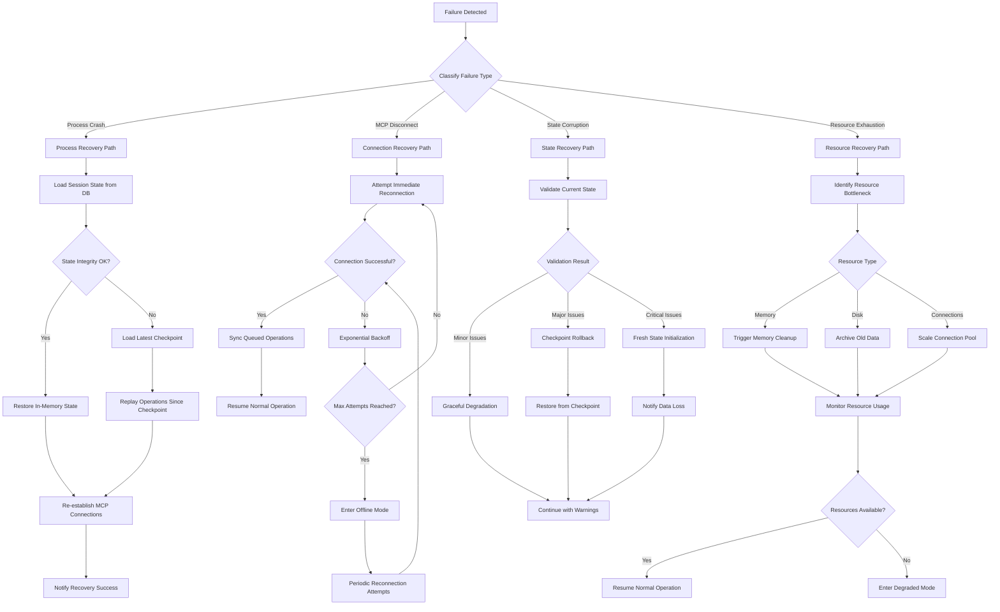
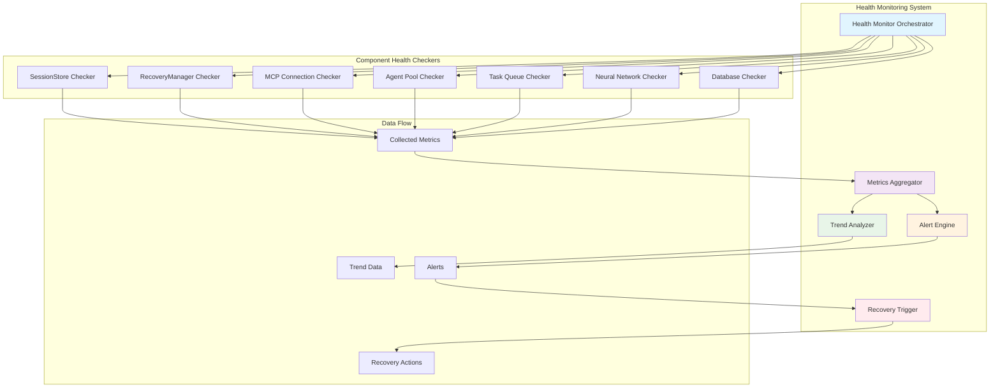
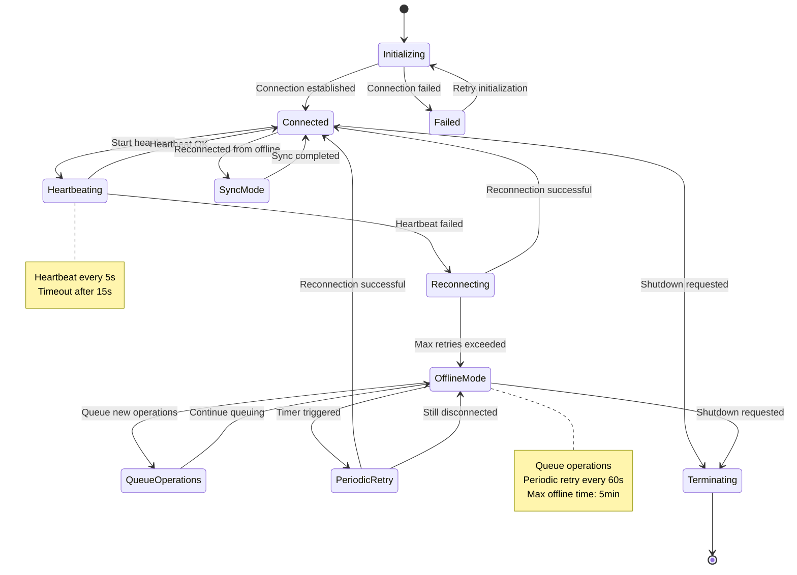
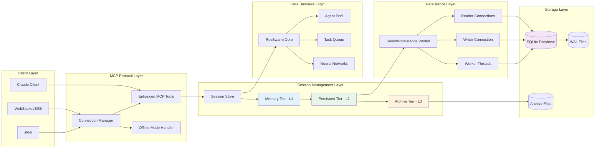
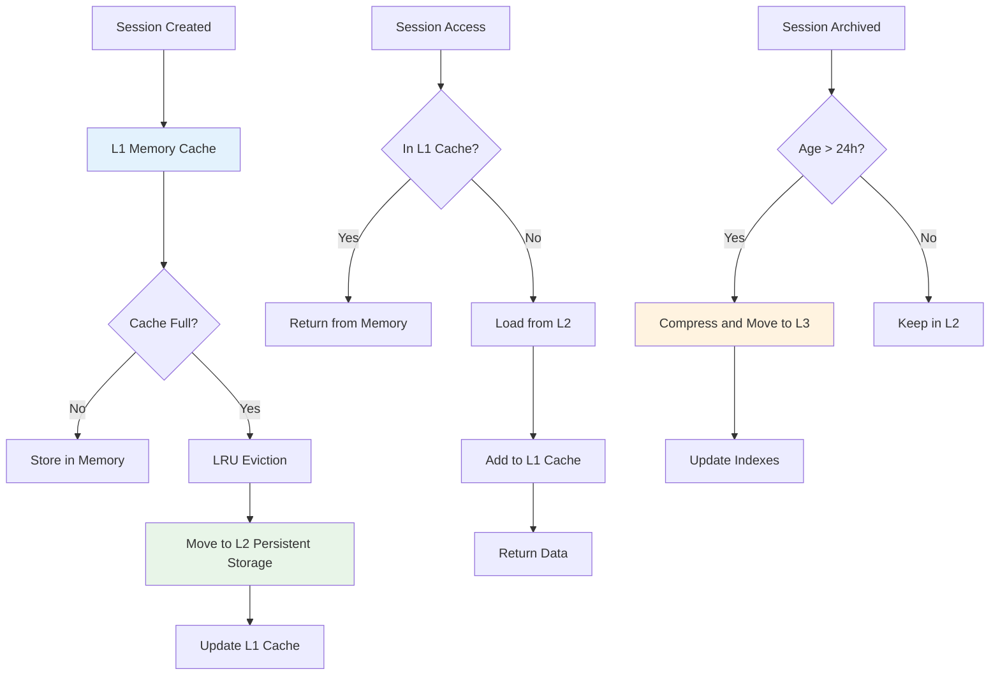
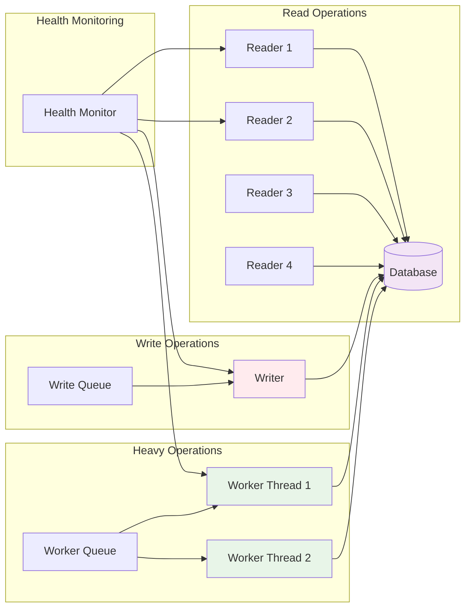

# Component Interaction Diagrams
## Session Persistence and Recovery Architecture - Issue #137

**Author**: System Architect Agent  
**Date**: 2025-01-24  
**Version**: 1.0  
**Parent Document**: [Session Persistence Architecture](./session-persistence-architecture.md)

---

## System Component Overview

### 1. High-Level Component Architecture

```
┌─────────────────────────────────────────────────────────────────────────────┐
│                           Session Management Layer                          │
├─────────────────────────────────────────────────────────────────────────────┤
│  ┌─────────────────┐  ┌─────────────────┐  ┌─────────────────┐              │
│  │   SessionStore  │  │ RecoveryManager │  │ HealthMonitor   │              │
│  │                 │  │                 │  │                 │              │
│  │ • Memory Tier   │  │ • Failure Detect│  │ • Metric Collect│              │
│  │ • Persistent    │  │ • Recovery Exec │  │ • Alert Manager │              │
│  │ • Archive Tier  │  │ • State Validation│ • Trend Analysis│              │
│  └─────────────────┘  └─────────────────┘  └─────────────────┘              │
├─────────────────────────────────────────────────────────────────────────────┤
│                        State Synchronization Layer                         │
├─────────────────────────────────────────────────────────────────────────────┤
│  ┌─────────────────┐  ┌─────────────────┐  ┌─────────────────┐              │
│  │  StateManager   │  │   EventBus      │  │ ChangeStream    │              │
│  │                 │  │                 │  │                 │              │
│  │ • State Sync    │  │ • Event Routing │  │ • Change Detect │              │
│  │ • Conflict Res  │  │ • Subscription  │  │ • Delta Compute │              │
│  │ • Consistency   │  │ • Broadcasting  │  │ • Stream Process│              │
│  └─────────────────┘  └─────────────────┘  └─────────────────┘              │
├─────────────────────────────────────────────────────────────────────────────┤
│                           Enhanced Core Systems                             │
├─────────────────────────────────────────────────────────────────────────────┤
│  ┌─────────────────┐  ┌─────────────────┐  ┌─────────────────┐              │
│  │ RuvSwarm        │  │ EnhancedMCP     │  │ SwarmPersistence│              │
│  │ (Enhanced)      │  │ Tools           │  │ Pooled          │              │
│  │                 │  │                 │  │                 │              │
│  │ • Session Aware │  │ • Session APIs  │  │ • Connection    │              │
│  │ • Auto Recovery │  │ • Connection Mgr│  │   Pool          │              │
│  │ • Health Report │  │ • Offline Mode  │  │ • HA Features   │              │
│  └─────────────────┘  └─────────────────┘  └─────────────────┘              │
└─────────────────────────────────────────────────────────────────────────────┘
```

---

## Detailed Component Interactions

### 2. Session Lifecycle Flow

```mermaid
sequenceDiagram
    participant Client as Client/Claude
    participant MCP as EnhancedMCPTools
    parameter SS as SessionStore
    participant RS as RuvSwarm
    participant DB as SwarmPersistence
    participant HM as HealthMonitor
    participant RM as RecoveryManager

    Client->>MCP: session_create(config)
    MCP->>SS: createSession(sessionConfig)
    SS->>DB: INSERT session record
    DB-->>SS: session saved
    SS->>RS: initializeSwarm(sessionId, config)
    RS-->>SS: swarm initialized
    SS->>HM: registerSession(sessionId)
    HM-->>SS: monitoring started
    SS-->>MCP: Session created
    MCP-->>Client: SessionCreateResult

    Note over Client,RM: Session is now active and monitored

    Client->>MCP: agent_spawn(sessionId, agentConfig)
    MCP->>RS: addAgent(agentConfig)
    RS->>DB: store agent state
    RS->>SS: updateSessionState(sessionId, newState)
    SS->>HM: updateMetrics(sessionId, agentAdded)
    RS-->>MCP: Agent spawned
    MCP-->>Client: AgentSpawnResult

    Note over Client,RM: Continuous health monitoring

    HM->>HM: collectMetrics()
    HM->>SS: getSessionHealth(sessionId)
    SS-->>HM: health metrics
    HM->>RM: checkThresholds(metrics)
    
    alt Health issue detected
        RM->>RM: triggerRecovery(sessionId, issue)
        RM->>SS: createCheckpoint(sessionId)
        RM->>Client: notifyHealthIssue(details)
    end
```

### 3. Recovery Process Flow



### 4. Health Monitoring Architecture



### 5. MCP Connection State Management



### 6. Data Flow Architecture



---

## Component Integration Points

### 7. RuvSwarm Core Integration

```typescript
// Enhanced RuvSwarm with session awareness
class EnhancedRuvSwarm extends RuvSwarm {
  constructor(options: SwarmOptions & { sessionId?: string }) {
    super(options);
    this.sessionId = options.sessionId;
    this.sessionStore = new SessionStore();
    this.recoveryManager = new RecoveryManager(this);
    this.healthMonitor = new HealthMonitor(this);
    
    // Register for recovery events
    this.recoveryManager.on('recovery-needed', this.handleRecovery.bind(this));
    this.healthMonitor.on('health-issue', this.handleHealthIssue.bind(this));
  }
  
  async addAgent(config: AgentConfig): Promise<string> {
    const agentId = await super.addAgent(config);
    
    // Session-aware persistence
    if (this.sessionId) {
      await this.sessionStore.updateSessionState(this.sessionId, {
        agents: this.state.agents,
        lastModified: new Date()
      });
      
      // Update health metrics
      await this.healthMonitor.recordMetric('agent_added', {
        sessionId: this.sessionId,
        agentId,
        timestamp: Date.now()
      });
    }
    
    return agentId;
  }
  
  private async handleRecovery(event: RecoveryEvent): Promise<void> {
    // Implement recovery logic specific to this swarm instance
  }
  
  private async handleHealthIssue(issue: HealthIssue): Promise<void> {
    // Implement health issue handling
  }
}
```

### 8. Enhanced MCP Tools Integration

```typescript
class SessionAwareMCPTools extends EnhancedMCPTools {
  constructor() {
    super();
    this.sessionManager = new SessionManager();
    this.connectionManager = new MCPConnectionManager();
  }
  
  async swarm_init(args: SwarmInitArgs & { sessionId?: string }): Promise<SwarmInitResult> {
    // Create or restore session
    let session: Session;
    
    if (args.sessionId) {
      // Restore existing session
      session = await this.sessionManager.getSession(args.sessionId);
      if (!session) {
        throw new Error(`Session ${args.sessionId} not found`);
      }
      
      // Trigger recovery if needed
      if (session.status === 'terminated' || session.status === 'recovering') {
        await this.recoveryManager.recoverSession(args.sessionId);
        session = await this.sessionManager.getSession(args.sessionId);
      }
    } else {
      // Create new session
      session = await this.sessionManager.createSession({
        configuration: args,
        parentSessionId: args.parentSessionId
      });
    }
    
    // Initialize swarm with session context
    const swarm = new EnhancedRuvSwarm({
      ...args,
      sessionId: session.sessionId
    });
    
    await swarm.init();
    
    // Store swarm reference
    this.activeSwarms.set(session.sessionId, swarm);
    
    return {
      success: true,
      sessionId: session.sessionId,
      swarmId: swarm.id,
      status: session.status
    };
  }
  
  async session_checkpoint(args: { sessionId: string }): Promise<SessionCheckpointResult> {
    const session = await this.sessionManager.getSession(args.sessionId);
    if (!session) {
      throw new Error(`Session ${args.sessionId} not found`);
    }
    
    const swarm = this.activeSwarms.get(args.sessionId);
    if (!swarm) {
      throw new Error(`No active swarm for session ${args.sessionId}`);
    }
    
    // Create checkpoint
    const checkpoint = await this.sessionManager.createCheckpoint(args.sessionId, {
      state: swarm.getState(),
      metadata: {
        timestamp: new Date(),
        trigger: 'manual',
        agentCount: swarm.getAgentCount(),
        taskCount: swarm.getTaskCount()
      }
    });
    
    return {
      success: true,
      checkpointId: checkpoint.checkpointId,
      timestamp: checkpoint.timestamp,
      size: checkpoint.size
    };
  }
}
```

### 9. Database Integration Schema

```sql
-- Enhanced tables for session management integration

-- Extend existing swarms table
ALTER TABLE swarms ADD COLUMN session_id TEXT;
ALTER TABLE swarms ADD COLUMN session_status TEXT DEFAULT 'active';
CREATE INDEX IF NOT EXISTS idx_swarms_session ON swarms(session_id);

-- Extend existing agents table  
ALTER TABLE agents ADD COLUMN session_id TEXT;
CREATE INDEX IF NOT EXISTS idx_agents_session ON agents(session_id);

-- Extend existing tasks table
ALTER TABLE tasks ADD COLUMN session_id TEXT;
CREATE INDEX IF NOT EXISTS idx_tasks_session ON tasks(session_id);

-- Health monitoring integration
CREATE TABLE IF NOT EXISTS session_component_health (
  id INTEGER PRIMARY KEY AUTOINCREMENT,
  session_id TEXT NOT NULL,
  component_name TEXT NOT NULL,
  health_status TEXT NOT NULL,
  metrics TEXT,
  timestamp DATETIME DEFAULT CURRENT_TIMESTAMP,
  FOREIGN KEY (session_id) REFERENCES sessions(session_id)
);

CREATE INDEX IF NOT EXISTS idx_component_health_session ON session_component_health(session_id, timestamp);

-- MCP connection state integration
CREATE TABLE IF NOT EXISTS session_mcp_connections (
  id INTEGER PRIMARY KEY AUTOINCREMENT,
  session_id TEXT NOT NULL,
  connection_id TEXT NOT NULL,
  protocol_type TEXT NOT NULL,
  status TEXT NOT NULL,
  capabilities TEXT,
  last_heartbeat DATETIME,
  created_at DATETIME DEFAULT CURRENT_TIMESTAMP,
  updated_at DATETIME DEFAULT CURRENT_TIMESTAMP,
  FOREIGN KEY (session_id) REFERENCES sessions(session_id),
  UNIQUE(session_id, connection_id)
);

CREATE INDEX IF NOT EXISTS idx_mcp_connections_session ON session_mcp_connections(session_id);
```

---

## Performance Considerations

### 10. Memory Management Strategy



### 11. Connection Pool Optimization



---

## Conclusion

These component interaction diagrams provide a comprehensive view of how the session persistence and recovery architecture integrates with the existing ruv-swarm system. The diagrams illustrate:

1. **Clear separation of concerns** between session management, recovery, and core functionality
2. **Robust data flow patterns** that ensure consistency and reliability
3. **Comprehensive integration points** that extend existing components without breaking changes
4. **Performance optimization strategies** that maintain system responsiveness
5. **Health monitoring architecture** that provides proactive issue detection

The architecture is designed to be:
- **Minimally invasive**: Builds upon existing components with minimal changes
- **Highly performant**: Uses multi-tier caching and connection pooling
- **Fault tolerant**: Provides multiple recovery mechanisms for different failure types
- **Observable**: Comprehensive health monitoring and alerting
- **Scalable**: Designed to handle enterprise workloads

This design ensures that the session persistence and recovery features integrate seamlessly with the existing ruv-swarm ecosystem while providing robust, production-ready capabilities.