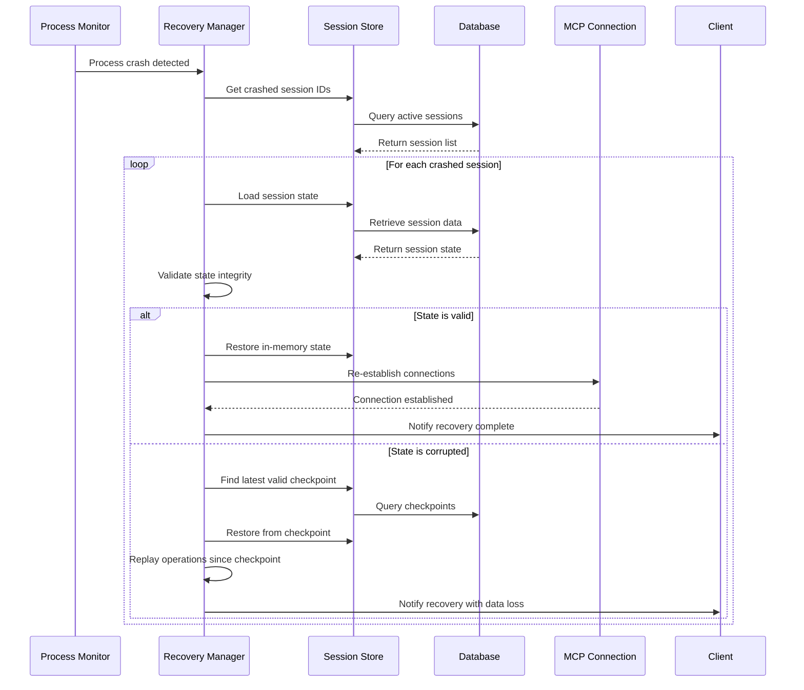
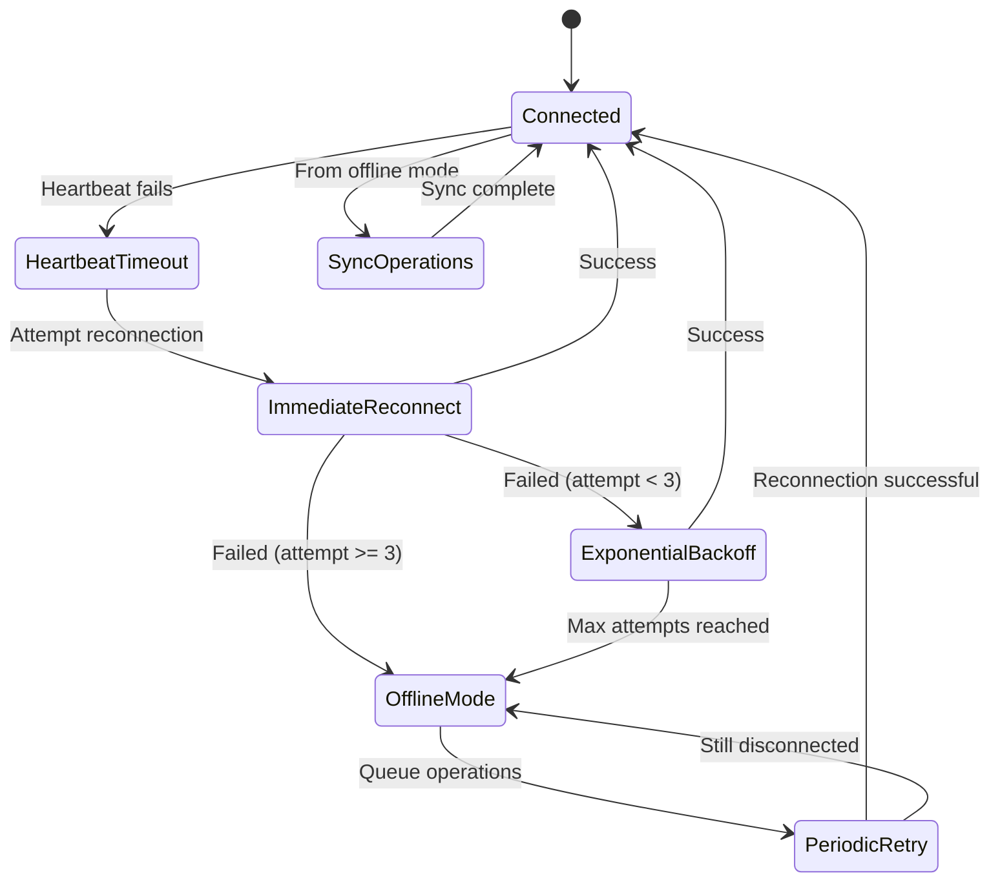
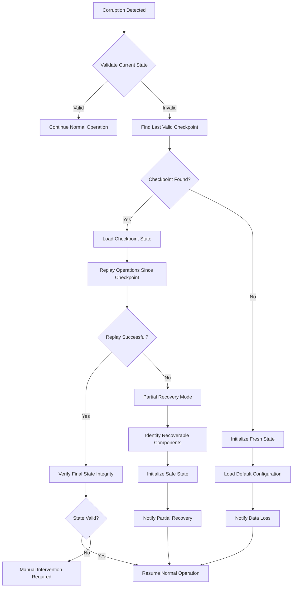

# Recovery Workflows Specification
## Detailed Recovery Mechanisms for Issue #137

**Author**: System Architect Agent  
**Date**: 2025-01-24  
**Version**: 1.0  
**Parent Document**: [Session Persistence Architecture](./session-persistence-architecture.md)

---

## Recovery Workflow Diagrams

### 1. Process Crash Recovery Workflow



### 2. MCP Connection Recovery Workflow



### 3. State Corruption Recovery Workflow



---

## Detailed Recovery Procedures

### 1. Process Crash Recovery

#### 1.1 Detection Phase
```typescript
class ProcessCrashDetector {
  private readonly heartbeatInterval = 5000; // 5 seconds
  private readonly timeoutThreshold = 15000; // 15 seconds
  
  async detectCrash(): Promise<CrashEvent> {
    const lastHeartbeat = await this.getLastHeartbeat();
    const timeSinceHeartbeat = Date.now() - lastHeartbeat.getTime();
    
    if (timeSinceHeartbeat > this.timeoutThreshold) {
      return {
        type: 'PROCESS_CRASH',
        detectedAt: new Date(),
        lastKnownState: await this.getLastKnownState(),
        severity: this.calculateSeverity(timeSinceHeartbeat)
      };
    }
    
    return null;
  }
}
```

#### 1.2 Recovery Execution
```typescript
class ProcessCrashRecovery {
  async execute(crashEvent: CrashEvent): Promise<RecoveryResult> {
    const recoveryId = this.generateRecoveryId();
    
    try {
      // Phase 1: State Assessment
      const sessionStates = await this.assessSessionStates();
      
      // Phase 2: Integrity Validation
      const validationResults = await Promise.all(
        sessionStates.map(state => this.validateStateIntegrity(state))
      );
      
      // Phase 3: Recovery Execution
      const recoveryResults = await Promise.all(
        validationResults.map(result => this.recoverSession(result))
      );
      
      // Phase 4: Connection Re-establishment
      await this.reestablishConnections(recoveryResults);
      
      // Phase 5: Notification
      await this.notifyRecoveryComplete(recoveryResults);
      
      return {
        success: true,
        recoveryId,
        sessionsRecovered: recoveryResults.length,
        totalTime: Date.now() - crashEvent.detectedAt.getTime()
      };
      
    } catch (error) {
      await this.handleRecoveryFailure(recoveryId, error);
      throw error;
    }
  }
}
```

### 2. MCP Connection Recovery

#### 2.1 Connection State Management
```typescript
class MCPConnectionRecovery {
  private readonly maxImmediateRetries = 3;
  private readonly backoffMultiplier = 2;
  private readonly maxBackoffDelay = 30000; // 30 seconds
  private readonly offlineModeTimeout = 300000; // 5 minutes
  
  async handleConnectionLoss(connectionId: string): Promise<void> {
    const connection = await this.getConnection(connectionId);
    
    // Immediate reconnection attempts
    for (let attempt = 1; attempt <= this.maxImmediateRetries; attempt++) {
      try {
        await this.reconnect(connection);
        await this.syncQueuedOperations(connection);
        return; // Success
      } catch (error) {
        if (attempt === this.maxImmediateRetries) {
          break; // Move to exponential backoff
        }
        await this.delay(1000 * attempt); // Linear backoff for immediate retries
      }
    }
    
    // Exponential backoff phase
    await this.exponentialBackoffRecovery(connection);
  }
  
  private async exponentialBackoffRecovery(connection: MCPConnection): Promise<void> {
    let delay = 1000; // Start with 1 second
    let attempt = 1;
    
    while (delay < this.maxBackoffDelay) {
      try {
        await this.delay(delay);
        await this.reconnect(connection);
        await this.syncQueuedOperations(connection);
        return; // Success
      } catch (error) {
        delay *= this.backoffMultiplier;
        attempt++;
      }
    }
    
    // Enter offline mode
    await this.enterOfflineMode(connection);
  }
  
  private async enterOfflineMode(connection: MCPConnection): Promise<void> {
    connection.status = 'offline';
    
    // Start periodic reconnection attempts
    const periodicTimer = setInterval(async () => {
      try {
        await this.reconnect(connection);
        clearInterval(periodicTimer);
        await this.exitOfflineMode(connection);
      } catch (error) {
        // Continue periodic attempts
      }
    }, 60000); // Try every minute
    
    // Set timeout for offline mode
    setTimeout(() => {
      clearInterval(periodicTimer);
      this.handleOfflineModeTimeout(connection);
    }, this.offlineModeTimeout);
  }
}
```

### 3. State Corruption Recovery

#### 3.1 Corruption Detection
```typescript
class StateCorruptionDetector {
  async detectCorruption(sessionId: string): Promise<CorruptionReport> {
    const state = await this.getSessionState(sessionId);
    const issues: CorruptionIssue[] = [];
    
    // Check data integrity
    const integrityCheck = await this.verifyIntegrity(state);
    if (!integrityCheck.valid) {
      issues.push({
        type: 'INTEGRITY_VIOLATION',
        severity: 'HIGH',
        details: integrityCheck.errors
      });
    }
    
    // Check referential consistency
    const consistencyCheck = await this.verifyConsistency(state);
    if (!consistencyCheck.valid) {
      issues.push({
        type: 'CONSISTENCY_VIOLATION',
        severity: 'MEDIUM',
        details: consistencyCheck.errors
      });
    }
    
    // Check business logic constraints
    const constraintCheck = await this.verifyConstraints(state);
    if (!constraintCheck.valid) {
      issues.push({
        type: 'CONSTRAINT_VIOLATION',
        severity: 'LOW',
        details: constraintCheck.errors
      });
    }
    
    return {
      sessionId,
      corruptionDetected: issues.length > 0,
      issues,
      recommendedAction: this.getRecommendedAction(issues)
    };
  }
}
```

#### 3.2 Recovery Strategy Selection
```typescript
class CorruptionRecoveryStrategy {
  selectStrategy(report: CorruptionReport): RecoveryStrategy {
    const highSeverityIssues = report.issues.filter(i => i.severity === 'HIGH');
    const mediumSeverityIssues = report.issues.filter(i => i.severity === 'MEDIUM');
    
    if (highSeverityIssues.length > 0) {
      // Critical corruption - checkpoint rollback required
      return {
        type: 'CHECKPOINT_ROLLBACK',
        priority: 'HIGH',
        estimatedDataLoss: this.estimateDataLoss('CHECKPOINT_ROLLBACK'),
        estimatedRecoveryTime: this.estimateRecoveryTime('CHECKPOINT_ROLLBACK')
      };
    }
    
    if (mediumSeverityIssues.length > 0) {
      // Moderate corruption - partial recovery possible
      return {
        type: 'PARTIAL_RECOVERY',
        priority: 'MEDIUM',
        estimatedDataLoss: this.estimateDataLoss('PARTIAL_RECOVERY'),
        estimatedRecoveryTime: this.estimateRecoveryTime('PARTIAL_RECOVERY')
      };
    }
    
    // Minor corruption - graceful degradation
    return {
      type: 'GRACEFUL_DEGRADATION',
      priority: 'LOW',
      estimatedDataLoss: 0,
      estimatedRecoveryTime: 1000 // 1 second
    };
  }
}
```

---

## Recovery Testing Framework

### 1. Chaos Engineering Tests

#### 1.1 Process Kill Tests
```typescript
class ProcessKillTest {
  async executeTest(): Promise<TestResult> {
    // Setup test environment
    const session = await this.createTestSession();
    const initialState = await this.captureState(session);
    
    // Execute chaos
    await this.killProcess(session.processId);
    
    // Wait for recovery
    const recoveryResult = await this.waitForRecovery(session.sessionId, 30000);
    
    // Validate recovery
    const finalState = await this.captureState(session);
    const stateComparison = this.compareStates(initialState, finalState);
    
    return {
      testName: 'Process Kill Recovery',
      success: recoveryResult.success && stateComparison.dataIntegrityMaintained,
      recoveryTime: recoveryResult.recoveryTime,
      dataLoss: stateComparison.dataLoss,
      issues: stateComparison.issues
    };
  }
}
```

#### 1.2 Connection Drop Tests
```typescript
class ConnectionDropTest {
  async executeTest(): Promise<TestResult> {
    const session = await this.createTestSession();
    
    // Simulate connection drop
    await this.simulateNetworkPartition(session.connectionId);
    
    // Verify offline mode activation
    const offlineModeActive = await this.verifyOfflineMode(session);
    
    // Restore connection
    await this.restoreNetwork(session.connectionId);
    
    // Verify reconnection and sync
    const reconnected = await this.waitForReconnection(session, 60000);
    const queuedOpsSync = await this.verifyQueuedOperationsSync(session);
    
    return {
      testName: 'Connection Drop Recovery',
      success: offlineModeActive && reconnected && queuedOpsSync,
      phases: {
        offlineModeActivation: offlineModeActive,
        reconnection: reconnected,
        operationSync: queuedOpsSync
      }
    };
  }
}
```

### 2. Recovery Validation Framework

#### 2.1 State Integrity Validation
```typescript
class StateIntegrityValidator {
  async validateRecovery(
    preFailureState: SessionState,
    postRecoveryState: SessionState
  ): Promise<ValidationResult> {
    
    const results: ValidationCheck[] = [];
    
    // Agent state validation
    results.push(await this.validateAgentStates(
      preFailureState.agents,
      postRecoveryState.agents
    ));
    
    // Task state validation
    results.push(await this.validateTaskStates(
      preFailureState.tasks,
      postRecoveryState.tasks
    ));
    
    // Connection state validation
    results.push(await this.validateConnectionStates(
      preFailureState.connections,
      postRecoveryState.connections
    ));
    
    // Memory state validation
    results.push(await this.validateMemoryStates(
      preFailureState.memory,
      postRecoveryState.memory
    ));
    
    return {
      overallSuccess: results.every(r => r.passed),
      checks: results,
      dataLossPercentage: this.calculateDataLoss(results),
      integrityScore: this.calculateIntegrityScore(results)
    };
  }
}
```

---

## Performance Optimization Strategies

### 1. Recovery Time Optimization

#### 1.1 Parallel Recovery Processing
```typescript
class OptimizedRecoveryManager {
  async recoverMultipleSessions(sessionIds: string[]): Promise<RecoveryResult[]> {
    // Group sessions by recovery complexity
    const sessionGroups = this.groupSessionsByComplexity(sessionIds);
    
    // Process groups in parallel with different strategies
    const recoveryPromises = sessionGroups.map(group => {
      switch (group.complexity) {
        case 'LOW':
          return this.parallelRecovery(group.sessions, 8); // High parallelism
        case 'MEDIUM':
          return this.parallelRecovery(group.sessions, 4); // Medium parallelism
        case 'HIGH':
          return this.sequentialRecovery(group.sessions); // Sequential for safety
      }
    });
    
    const results = await Promise.all(recoveryPromises);
    return results.flat();
  }
  
  private async parallelRecovery(
    sessions: SessionInfo[],
    concurrency: number
  ): Promise<RecoveryResult[]> {
    const semaphore = new Semaphore(concurrency);
    
    return Promise.all(
      sessions.map(async session => {
        await semaphore.acquire();
        try {
          return await this.recoverSession(session);
        } finally {
          semaphore.release();
        }
      })
    );
  }
}
```

#### 1.2 Checkpoint Strategy Optimization
```typescript
class OptimizedCheckpointStrategy {
  private readonly checkpointIntervals = new Map([
    ['HIGH_ACTIVITY', 30000], // 30 seconds
    ['MEDIUM_ACTIVITY', 120000], // 2 minutes
    ['LOW_ACTIVITY', 300000], // 5 minutes
  ]);
  
  async determineCheckpointInterval(sessionId: string): Promise<number> {
    const activity = await this.analyzeSessionActivity(sessionId);
    return this.checkpointIntervals.get(activity) || 120000;
  }
  
  async createIncrementalCheckpoint(sessionId: string): Promise<Checkpoint> {
    const lastCheckpoint = await this.getLastCheckpoint(sessionId);
    const currentState = await this.getCurrentState(sessionId);
    
    // Only store the delta since last checkpoint
    const delta = this.computeStateDelta(lastCheckpoint.state, currentState);
    
    return {
      id: this.generateCheckpointId(),
      sessionId,
      type: 'INCREMENTAL',
      timestamp: new Date(),
      delta,
      parentCheckpointId: lastCheckpoint.id,
      size: this.calculateSize(delta)
    };
  }
}
```

---

## Monitoring and Alerting

### 1. Recovery Metrics Dashboard

#### 1.1 Key Performance Indicators
```typescript
interface RecoveryMetrics {
  // Recovery success rates
  overallRecoverySuccessRate: number;
  recoverySuccessRateByType: Map<FailureType, number>;
  
  // Recovery timing
  meanTimeToRecovery: number;
  recoveryTimeP95: number;
  recoveryTimeP99: number;
  
  // Data integrity
  dataLossPercentage: number;
  integrityValidationSuccessRate: number;
  
  // System health
  systemAvailability: number;
  checksumValidationFailures: number;
  corruptionDetectionAccuracy: number;
}
```

#### 1.2 Alert Configuration
```typescript
class RecoveryAlertManager {
  private readonly alertThresholds = {
    recoveryFailureRate: 0.01, // 1%
    meanTimeToRecovery: 30000, // 30 seconds
    dataLossThreshold: 0.001, // 0.1%
    availabilityThreshold: 0.999, // 99.9%
  };
  
  async evaluateAlerts(metrics: RecoveryMetrics): Promise<Alert[]> {
    const alerts: Alert[] = [];
    
    if (metrics.overallRecoverySuccessRate < (1 - this.alertThresholds.recoveryFailureRate)) {
      alerts.push({
        type: 'RECOVERY_FAILURE_RATE_HIGH',
        severity: 'CRITICAL',
        message: `Recovery success rate (${metrics.overallRecoverySuccessRate}) below threshold`,
        timestamp: new Date()
      });
    }
    
    if (metrics.meanTimeToRecovery > this.alertThresholds.meanTimeToRecovery) {
      alerts.push({
        type: 'RECOVERY_TIME_HIGH',
        severity: 'WARNING',
        message: `Mean recovery time (${metrics.meanTimeToRecovery}ms) above threshold`,
        timestamp: new Date()
      });
    }
    
    return alerts;
  }
}
```

---

## Conclusion

This detailed recovery workflow specification provides the technical foundation for implementing robust recovery mechanisms in the ruv-swarm system. The comprehensive approach covers all major failure scenarios with well-defined procedures, performance optimizations, and monitoring capabilities.

The implementation of these workflows will ensure that the system can handle failures gracefully while maintaining data integrity and minimizing downtime. The testing framework provides confidence in the recovery mechanisms, while the monitoring and alerting capabilities enable proactive maintenance and continuous improvement.